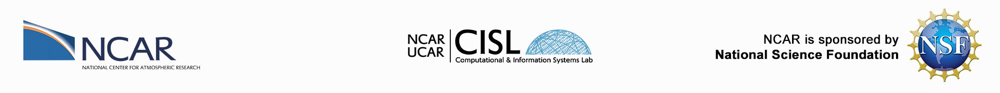

# GPU Computing Workshop Series for the Earth Science Community
With support from the National Center for Atmospheric Reserach (NCAR), the Consulting Services Group (CSG), and the Application Scalability and Performance Group (ASAP) team under the Computational and Information Systems Laboratory (CISL), we present this GPU training series for scientists, software engineers, and students, with emphasis on Earth science applications.

The content of this course is coordinated with the series of [GPU Training sessions](https://www2.cisl.ucar.edu/what-we-do/training-library/gpu-computing-workshops) starting in Februrary 2022. The NVIDIA High Performance Computing Software Development Kit (NVHPC SDK) and CUDA Toolkit will be the primary software requirements for this training which will be already available on NCAR's HPC clusters as modules you may load. This software is free to download from NVIDIA by navigating to the [NVHPC SDK Current Release Downloads](https://developer.nvidia.com/nvidia-hpc-sdk-downloads 'NVHPC SDK') page and the [CUDA Toolkit](https://developer.nvidia.com/cuda-downloads 'CUDA Toolkit') downloads page. Any provided code is written specifically to build and run on NCAR's Casper HPC system but may be adapted to other systems or personal machines. Material will be updated as appropriate for the future deployment of NCAR's Derecho cluster and as technology progresses.

We actively encourage that all participants join the [NCAR GPU Users Slack](ncargpuusers.slack.com). Invite links will be sent to registered participants. This communication platform is not only intended to offer support and answer questions about GPU computing, but also aid in the fostering of collegial networks and building the Earth science community towards greater collaborative research opportunities. Feel free to get involved in this space and share your thoughts and ideas you're exploring that may benefit from GPU computing.

## Course Content Contributors

* Brian Vanderwende - Software Engineer III CISL/CSG
* Cena Miller - Software Engineer II CISL/ASAP
* Daniel Howard - Software Engineer I CISL/CSG
* Shiquan Su - Software Engineer III CISL/CSG
* Supreeth Suresh - Software Engineer II CISL/ASAP

## Coordinates

* Dates: February through September 2022
* Format: 1 hour sessions roughly every 2 weeks
* Communication: Emails to registrants and open discussion in [NCAR GPU Users Slack](ncargpuusers.slack.com).
* Support and offce hours: Schedule time with workshop organizers in Slack or submit a ticket to [support.ucar.edu](https://support.ucar.edu).
* Register [here](https://docs.google.com/forms/d/e/1FAIpQLSe6g0jGCYthfB9wQe6pNDl7dLO1321EM2vDu7YUSoc0kjISCw/viewform) to receive a link for interactive Zoom sessions
* Course Materials: In addition to code examples archived in this Github repository, slides and video recordings of sessions will be archived on each individual session's webpage accessed [here](https://www2.cisl.ucar.edu/what-we-do/training-library/gpu-computing-workshops).

## Course Outline

The full course description detailing learning objectives and material to be covered can be found [here](https://docs.google.com/document/d/1Tovha_SA0-4QPdOkc1Z89KQgVNAUsTDLNa_PqeCAvhU/edit#heading=h.90nvn0bxldkr). The condensed schedule for topics to cover is listed below.

1. [Introduction to Parallel Programming](01_IntroParallel)
    * [Slides](01_IntroParallel/Introduction%20to%20Parallel%20Programming%20-%20Shiquan%20Su,%20GPU%20Training%2020220203.pdf) - [Recording](https://youtu.be/UjK0O412A60)
2. [Why Use GPU Accelerators](02_WhyGPUs)
    * [Slides](02_WhyGPUs/Why%20Use%20GPU%20Accelerators%20-%20Daniel%20Howard,%20GPU%20Training%2020220217.pdf) - [Recording](https://youtu.be/zKb2ISrVEcU)
3. [Introduction to GPU and Accelerator Architectures](03_IntroGPUArch)
    * [Slides](03_IntroGPUArch/Introduction%20to%20GPU%20and%20Accelerator%20Architectures%20-%20Brent%20Leback,%20GPU%20Training%2020220303.pdf) - [Recording](https://youtu.be/82GiossgAIQ)
4. [Software Infrastructure and Make Systems](04_SoftInfrastrucure)
    * [Slides](04_SoftInfrastrucure/Software%20Infrastructure%20and%20Make%20Systems%20-%20Vanderwende%2020220317.pdf) - [Recording](https://youtu.be/vzOAZpg2w8s)
5. [Directive Based Programming with OpenACC](05_DirectivesOpenACC) (two sessions)
    * Slides [Part 1](05_DirectivesOpenACC/05_openACC_miniWeather_Tutorial.slides.pdf) and [Part 2](05_DirectivesOpenACC/05p2_openACC_miniWeather_Tutorial.slides.pdf) - Recordings [Part 1](https://youtu.be/NYEas1HVS00) and [Part 2](https://youtu.be/nAyqaYeshXM)
7. [Hands-On Session Using OpenACC in MPAS-A](07_HandsOnMPASA)
    * [Slides](07_HandsOnMPASA/07_HandsOnMPASA.slides.pdf) - [Recording](https://youtu.be/AwaEHzUcPWs)
8. Verifying Code Correctness with PCAST
    * [Slides](08_PCAST/08_PCAST.slides.pdf) - [Recording](https://youtu.be/GBledvf6mDs)
9. IDEs, Debugging, and Optimization Tools for GPU Computing
10. Hands-On Session with Nsight Systems and Compute
11. Multi-GPU Programming (two sessions)
13. Co-Design Process Training for Scientists and Project Leads
14. CuPy and NumPy/SciPy via Legate/cuNumerics
15. Numba with CUDA, CuPy, and Dask
16. Optimizing AI/ML workflows in Python for GPUs

We have decided to focus primarily on descriptive and directive based programming plus usage of libraries/APIs in this GPU training program given the greater ease of deployment and cost savings in development time while still achieving significant performance. Nonetheless, many of the directive based and/or library implementations can work alongside CUDA kernels for when the greatest control of GPU hardware or performance optimizations are required. We recommend consulting this 9-part [CUDA Training Series](https://www.olcf.ornl.gov/cuda-training-series/ 'CUDA Training') offered by Oak Ridge national Laboratory or other resources for a more in depth training on CUDA code development.

## Course References, Resources, and Other Learning Materials

We will design this course to be self-contained but given the limited time and the ever changing landscape in GPU computing, we recommend you consult additional resources for your own personal development. We have already consolidated a wide set of relevant resources in this [public Google Drive folder](https://drive.google.com/drive/folders/1e5cfjwIIiTogd3n894V6uwtKDs8wdAuo) which you are welcome to explore. Some of this material will be used as references for specific sessions.

## Instructions and Setting Up Your Environment
We will primarily be using interactive Jupyter notebooks and Jupyter's built-in development platform to present material and streamline hands-on sessions for users as well as provide other exercices. Each session will have a provided link in the associated session folder to directly open relevant content on NCAR's Casper HPC cluster using the [nbgitpuller](https://jupyterhub.github.io/nbgitpuller/use.html) interface. This allows learners to pull in content automatically to their `$HOME` folder on GLADE, Casper's storage system, without needing to interact with Github. Learners should be able to edit sourced content freely with minimal fear of lost progress or merge issues given nbgitpuller's [automatic merge behavior](https://jupyterhub.github.io/nbgitpuller/topic/automatic-merging.html).

**DISCLAIMER** `nbgitpuller` is presently having some issues on NCAR's Jupyter Hub cluster. In the meantime, we will explain how to source this content through git commands manually.

If you are not using Casper or encounter issues updating your repository to the latest version, please consult the recommended steps in [GIT_INSTRUCTIONS](GIT_INSTRUCTIONS.md) for using git or reach out to workshop organizers. 

For each interactive session, the respective session folder will feature a Jupyter Notebook of the presented material as well as folders named with the language and/or programming style used in any relevant examples presented. Consult the `README.md` file in each session folder for any specifics about running provided code.
